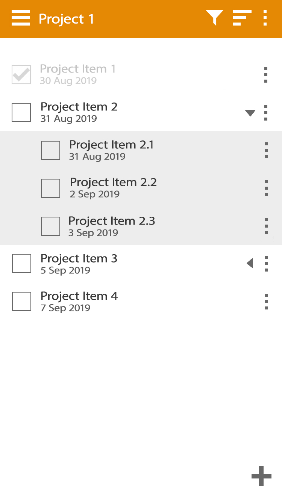

## Multi Media UI Assignment

### Tools

For this assignment I used Adobe Illustrator for the wireframes and Photoshop for the mock-ups.

The reason why I used Illustrator for the wireframes is because of how it manages its objects. Every shape placed on the page can be moved and resized separately even when they're on the same layer. Since Illustrator is a vector-based software the elements never lost any quality. This was useful for making the wireframes as I was moving and changing the elements on the page frequently.

### Sketches

before I started making the wireframes I downloaded 7 homework/task manager apps so that I could keep my app consistent
- Study Planner
- Dreamie Planner
- Remember the Milk
- Any.do
- Planner Pro
- School Planner
- MyLifeOrganized: To-Do List

After testing those apps I started making some basic sketches of the layout and the UI elements.

### Wireframes

<!-- The Modal -->

  <!-- The Close Button -->
  &times;

  <!-- Modal Content (The Image) -->
  

  <!-- Modal Caption (Image Text) -->
  

### Mockups

### Design Decisions

My intention with this app was to have a fast, easy and efficient way of viewing, completing and adding tasks to the app. Because of this the mock-up’s I have created are very minimalistic in order to keep the users focus on the listed items. I experimented with using gradients and images however they added too much noise to the screen (becoming too distracting and making it too hard to understand at a quick glance).

The coloured bars too the side of each list item represent what subject the homework is for (when adding a subject to the app you pick a colour for it). This adds a quick way to identify what subject the class is for without writing it under the date. The colours also make the page more visually interesting, because of this I could keep the rest of the app in greyscale (so that it always matches the colour of the subject and doesn’t take too much attention away from the homework which is the most important part of the app).

However, I didn’t add these bars to the project’s items. This was because a project will most likely be for one subject. Having a single colour bar down the side of the page for all items didn’t look very appealing. So instead I changed the colour of the header. So, the design I had didn’t have any colour, however that made the page very boring to look at and didn’t provide an easy way to identify what subject the project was for. Because of this I changed the colour of the header.

I’ve kept my app very consistent with other similar apps and software
-	All of my icons are blocky versions of already existing icons
-	The menu button is located in the top right
-	The add button is in the bottom right (some of the apps i tested had the add button in the bottom center, however because of Fitts law I decided to add mine to the right. I found having the button in the middle to be annoying to try to tap)
- checkboxes are located on the left of a task
- icons to edit tasks are on the right
